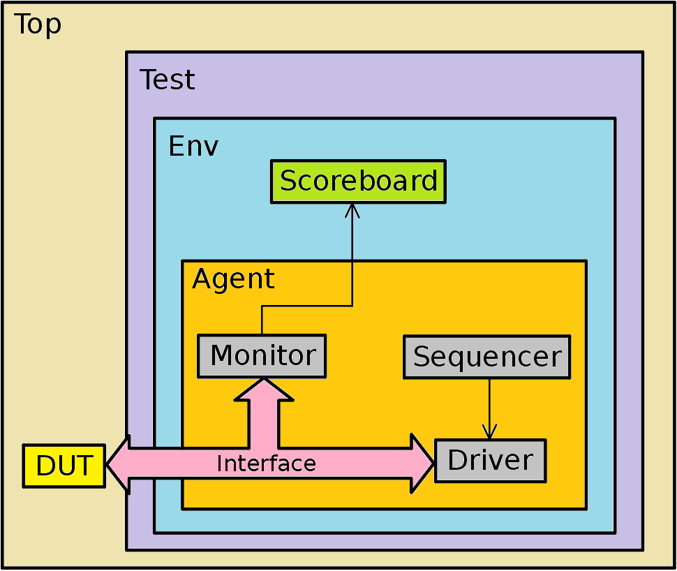
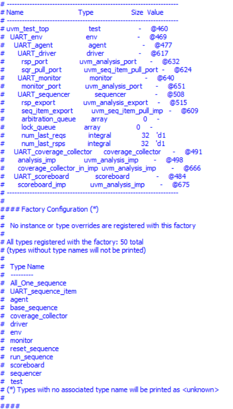
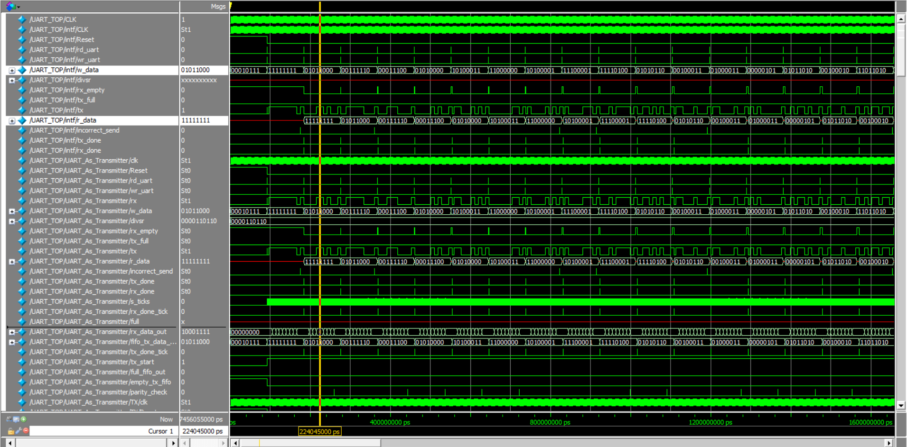
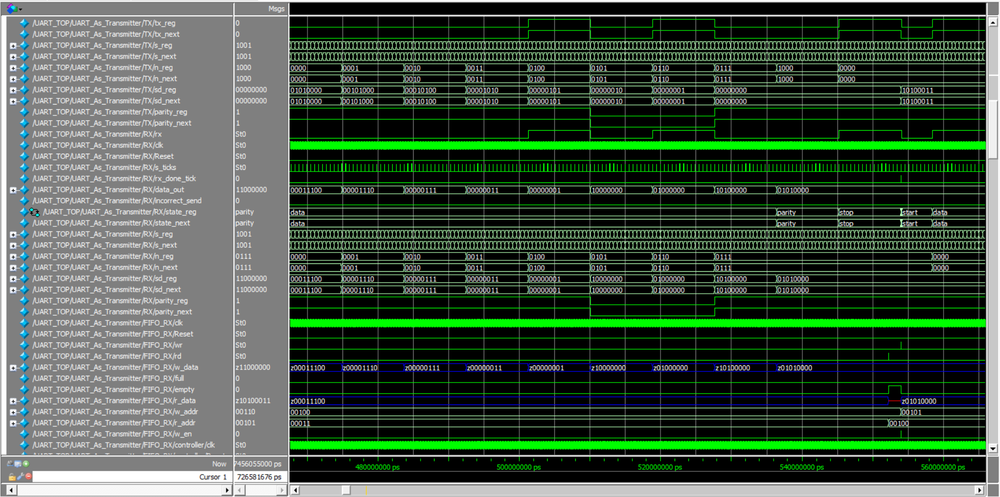
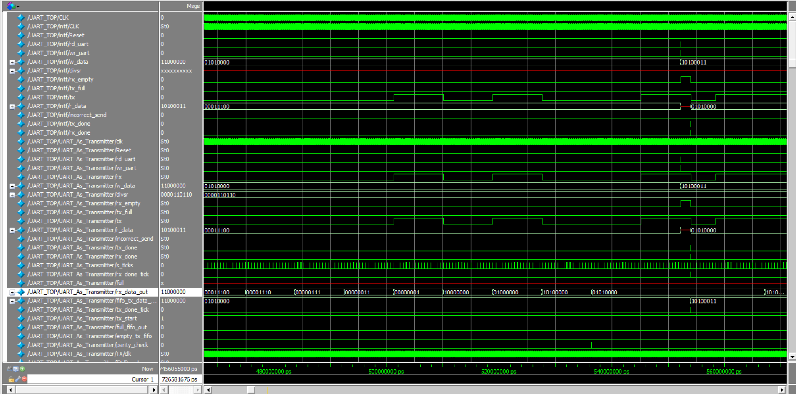

# UART-Verification-Based-On-UVM
UART (Universal Asynchronous Receiver/Transmitter) is a hardware communication protocol that is used for asynchronous serial communication. UART is commonly used for communication between microcontrollers and peripheral devices such as sensors, modems, and other microcontrollers. It is widely used because of its simplicity and effectiveness:
## How UART Works:
1- Asynchronous Communication:  
- UART is asynchronous, meaning it does not use a clock signal to synchronize the transmitter and receiver. Instead, it relies on the baud rate (the speed of data transmission) to maintain proper timing. 

2- Components of UART: 
- Transmitter (TX): The component that sends data. 
- Receiver (RX): The component that receives data. 
- FIFO (Memory): The component that the data is stored in and extracted from . 
- Baudrate generator (RX): The component that generate the ticks to transfer and receive bits. 

3- Data Format: 

- Data is typically sent in packets that include a start bit, data bits, optional parity bit, and stop bits. 
- Start Bit: Indicates the beginning of a data packet (usually set to 0). 
- Data Bits: The actual data being transmitted (commonly 7 or 8 bits). 
- Parity Bit (optional): Used for error checking (can be even or odd). 
- Stop Bits: Indicates the end of a data packet (can be 1, 1.5, or 2 bits, usually set to 1). 

4- Transmission Process: 

- Idle State: The line is in a high state (logic 1). 
- Start Bit: When the transmitter wants to send data, it pulls the line low (logic 0) to indicate the start bit. 
- Data Bits: The data bits are transmitted sequentially, starting with the least significant bit (LSB) to the most significant bit (MSB). 
- Parity Bit: If parity is used, the parity bit is sent after the data bits. 
- Stop Bit: The transmitter sets the line high (logic 1) to indicate the end of the data packet. 

5- Reception Process:

- The receiver continuously monitors the line for the start bit. 
- Once the start bit is detected, the receiver samples the data bits, parity bit (if used), and stop bits at the baud rate. 
- The received data is then processed and made available to the system. 
- The ALU is a critical component for executing the instructions of a program, as it handles the necessary computations and logic decisions. 

## Key Features of UART: 
- Simple Protocol: UART is simple and does not require complex hardware. 
- Error Checking: Basic error checking is provided through parity bits. 
- Flexible Baud Rates: Baud rates can be easily configured to match the communication needs. 
- Point-to-Point Communication: UART is typically used for direct communication between two devices. 
- Full-Duplex Communication: UART can transmit and receive data simultaneously using separate lines for TX and RX. 

## Applications of UART:
- Microcontroller Communication: Used to connect microcontrollers to sensors, modules, and other microcontrollers. 
- Serial Ports: Commonly found in computers for serial communication. 
- Modems: Used in modems for data communication over telephone lines. 
- Embedded Systems: Widely used in embedded systems for serial communication. 
  
##  UVM Testbench
### UVM Testbench Structure 
 
### UVM Testbench Topology & Factory Registrations 
 

### Data Transmitting and receiving 
- w_data signal is the write data at the TX and the r_data signal is the read data at the RX. 
 

## FSM Of TX and RX & FIFO Behavior 
- TX/n_reg is the current state of the TX and RX/n_reg is the same for RX and FSM starts when start bit 0 arrives. 
- States are {start , Data Transfer/Receiving , Parity , End}. 
- Also FIFO_RX is the fifo of the RX and the w_data is the data that received by the RX (when the receiver receives a bit the shift register will add it). 
- in FIFO_RX/r_data is the read data in FIFO and it will extract the data from the fifo when a read signal arrives. 
 

## Data Flow 
- rx_data_out signal also represents a shift register to the received data (look how the data flow in the register). 

 

